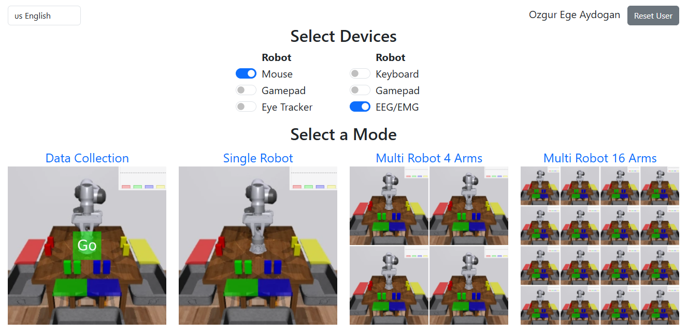

# Multiagent BMI Controller

**A real-time brain-machine interface (BMI) and keyboard-based controller for multi-agent robotic simulations.**

This system allows users to control simulated robotic arms via either **EEG-decoded brain signals** or **manual WASD input**, with a modular architecture designed for **fast interaction** and **multi-robot coordination** using WebSocket communication.

---

## Features
- Real-time robot control via keyboard or BMI-decoded EEG signals
- Pluggable BMI decoder stub for motor imagery (can be extended to SSVEP, P300, etc.)
- WebSocket-based communication with robot control WebUI
- Works with [multiagent-bmi-webui-collab](https://github.com/arayabrain/multiagent-bmi-webui-collab)
- Supports multi-robot control, object selection, and sequential tasks
- Easily extensible to other control paradigms (eye-tracking, EMG, etc.)

---

## Repository Structure

multiagent-bmi-controller/
├── app/
│ ├── bci/ # EEG decoder interface (stub)
│ └── controller.py # Command routing to robot
├── requirements.txt
├── README.md
└── LICENSE

---

## Demo

> **Live interaction demo (EEG → Robot grasp)**  
> 

## Screenshots

### Mode Selection & Control Interface


> Select from various control devices (Mouse, EEG/EMG, Keyboard) and modes like Single Robot, Multi-Robot (4 or 16 arms), or Data Collection. This WebUI allows seamless integration of BMI inputs and manual control for simulation testing.

### Robot Grasping a Target Object


> The robotic arm successfully grasps a green cube after receiving a decoded EEG command via the BMI pipeline. This validates real-time intent translation and control loop execution.

---

## Getting Started

### 1. Clone the repository
```bash
git clone https://github.com/OzgurEgeAydogan1/multiagent-bmi-controller.git
cd multiagent-bmi-controller
